<a name="readme-top"></a>
<div align="center">

  
  

  <h1>Adexa</h1>
  
  <p>
    <b>Adexa</b> is a phenomenal Ecommerce Dashboard App with everything you can imagine - built with React & TailwindCSS using Syncfusion
  </p>

  
<!-- Badges -->
<p>
  <a href="https://github.com/ladunjexa/Adexa-Ecommerce-Dashboard/graphs/contributors">
    
  </a>
  <a href="">
    
  </a>
  <a href="https://github.com/ladunjexa/Adexa-Ecommerce-Dashboard/network/members">
    
  </a>
  <a href="https://github.com/ladunjexa/Adexa-Ecommerce-Dashboard/stargazers">
    
  </a>
  <a href="https://github.com/ladunjexa/Adexa-Ecommerce-Dashboard/issues/">
    
  </a>
  <a href="https://github.com/ladunjexa/Adexa-Ecommerce-Dashboard/blob/master/LICENSE">
    
  </a>
</p>
   
 <h4>
    <a href="https://adexa-ecommerce-dashboard.vercel.app/">View Demo</a>
  <span> · </span>
    <a href="https://github.com/ladunjexa/Adexa-Ecommerce-Dashboard">Documentation</a>
  <span> · </span>
    <a href="https://github.com/ladunjexa/Adexa-Ecommerce-Dashboard/issues/">Report Bug</a>
  <span> · </span>
    <a href="https://github.com/ladunjexa/Adexa-Ecommerce-Dashboard/issues/">Request Feature</a>
  </h4>
</div>

<br />

<!-- Table of Contents -->
<details>

<summary>

# :notebook_with_decorative_cover: Table of Contents

</summary>

- [About the Project](#star2-about-the-project)
  * [Folder Structure](#bangbang-folder-structure)
  * [Tech Stack](#space_invader-tech-stack)
- [Getting Started](#toolbox-getting-started)
  * [Installation](#gear-installation)
- [Media](#milky_way-media)
- [Contributing](#wave-contributing)
- [License](#warning-license)
- [Contact](#handshake-contact)
- [Acknowledgements](#gem-acknowledgements)

</details>  

<!-- About the Project -->
## :star2: About the Project

<p align="center"> 
  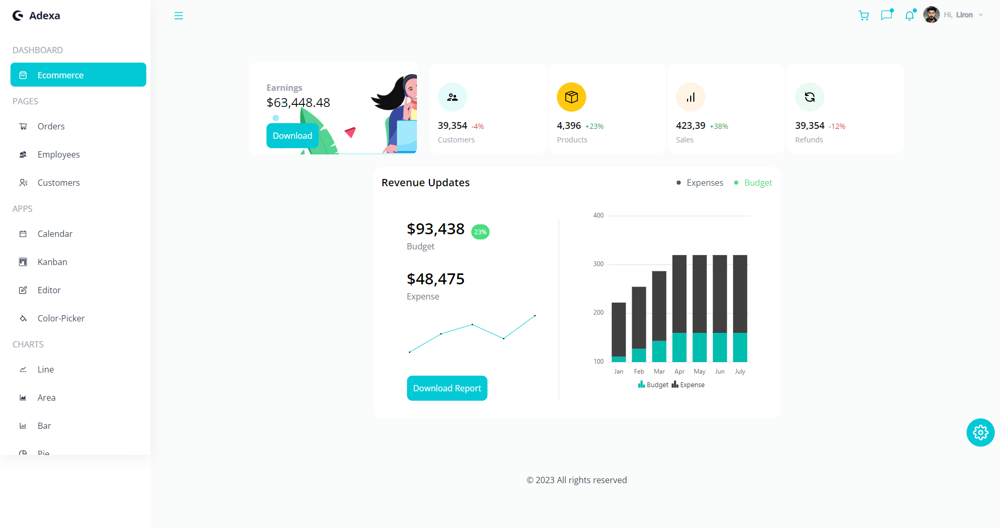
  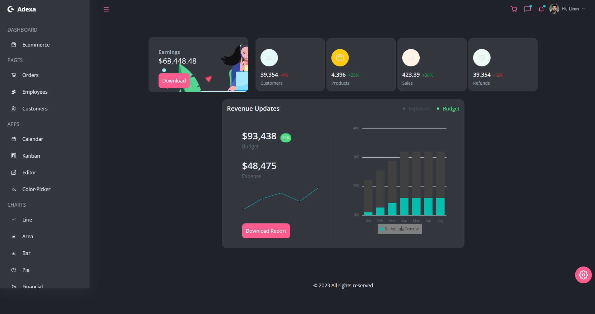
</div>
<br />

Adexa is an outstanding Ecommerce Dashboard Application with
awesome fully responsive UI using best practices of TailwindCSS along fully functionality apps based on Syncfusion the World's Best UI Component Suite.

<!-- Folder Structure -->
### :bangbang: Folder Structure

<b>Adexa</b> code folder structure
```
Adexa-Ecommerce-Dashboard/
|- src
  |-- components/
    |-- Charts/
  |-- contexts/
  |-- data/
  |-- pages/
    |-- Charts/
  |-- App.js
```

Now, lets dive into src folder.

### components

`Button.jsx` - `Cart.jsx` - `ChartsHeader.jsx` - `Chat.jsx` - `Footer.jsx` - `Header.jsx` - `Navbar.jsx` - `Notification.jsx` - `Sidebar.jsx` - `ThemeSettings.jsx` - `UserProfile` - `index.js`

This folder contains all the function components, which they're independent and reusable bits of code. They serve the UI (User Interface) of Adexa to avoid unnecessary repetition of the code.
those components are beautiful customized widgets using TailwindCSS to describe initial theme for widgets as they're named.

#### Charts

`LineChart.jsx` - `Pie.jsx` - `SparkLine.jsx` - `Stacked.jsx`

This sub-folder contains implementation of customized Charts Components using Syncfusion library

### contexts

This folder contains `ContextProvider.jsx` which implement Adanced State Management of the entire application using React Context API.

### data

This folder contains media of the application and a data file names `dummy.js` for the various data of the application, including contents, elments, theme, icons, information for charts, etc.

### pages

`Calendar.jsx` - `ColorPicker.jsx` - `Customers.jsx` - `Ecommerce.jsx` - `Editor.jsx` - `Employees.jsx` - `Kanban.jsx` - `Orders.jsx` - `index.jsx`

this folder contains activities / scenes of application as a exported react arrow function components.
this folder contains a well-structured activities / scenes of applications using advanced React Best Practices.
Adexa Dashboard includes Dashboard, 3 Pages, 4 Apps and 8 fully functional charts! 
among these, you can find a fully functional Calendar, a Kanban Board, a WYSIWYG Editor and a Color Picker Apps.

#### Charts

`Area.jsx` - `ColorMapping.jsx` - `Bar.jsx` - `Financial.jsx` - `Line.jsx` - `Pie.jsx` - `Pyramid.jsx` - `Stacked.jsx`

This sub-folder contains implementation of customized Charts pages using Syncfusion library. There're eigth different types of charts: Line, Area, Bar, Pie, Financial, Color-Mapping, Pyramid and Stacked using Syncfusion library.

<p align="right">(<a href="#readme-top">back to top</a>)</p>

<!-- TechStack -->
### :space_invader: Tech Stack


<p align="right">(<a href="#readme-top">back to top</a>)</p>

<!-- Getting Started -->
## 	:toolbox: Getting Started

<!-- Installation -->
### :gear: Installation

#### Step 1:
Download or clone this repo by using the link below:

```bash
 https://github.com/ladunjexa/Adexa-Ecommerce-Dashboard
```

#### Step 2:

Adexa using NPM (Node Package Manager), therefore, make sure that Node.js is installed by execute the following command in consle

```bash
  node -v
```

### Step 3:

Go to root folder and execute the following command to get the required packages:

```bash
  npm install
```

### Step 4:

At the root folder execute the following command in order to start the app:

```bash
  npm start
```

<p align="right">(<a href="#readme-top">back to top</a>)</p>

<!-- Media -->
## :milky_way: Media

### PAGES
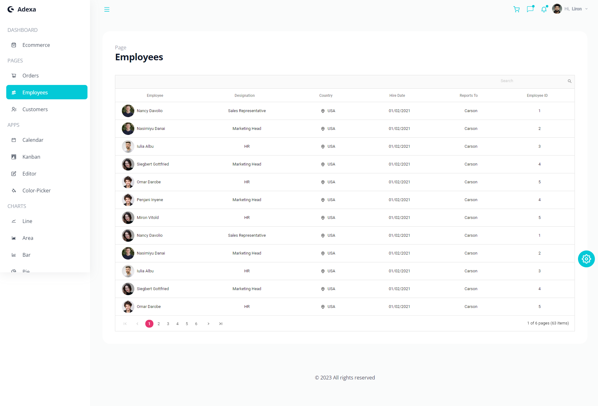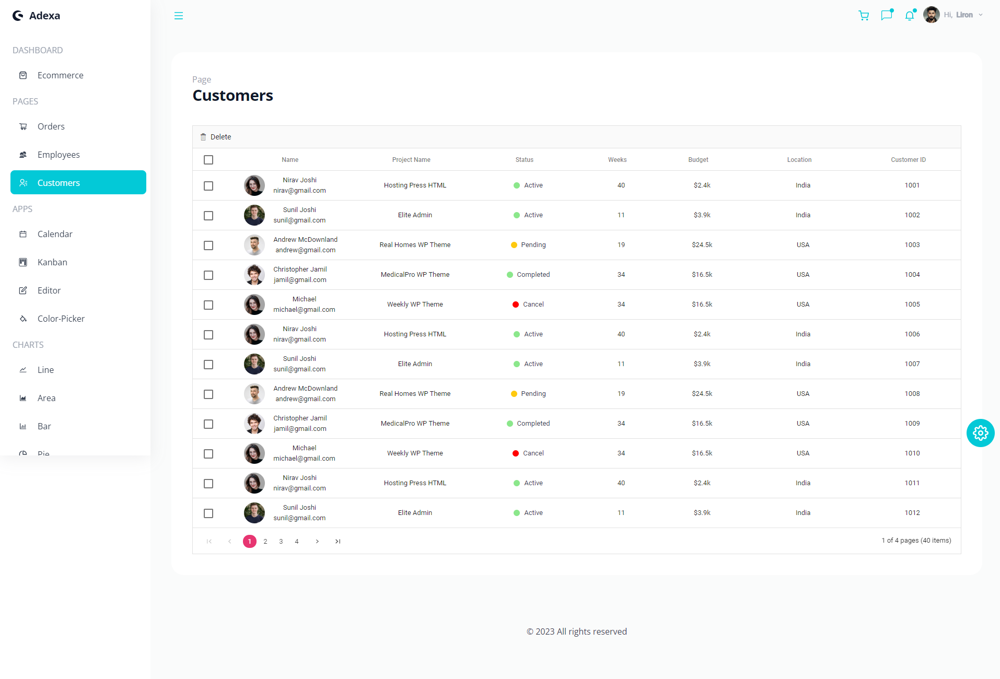
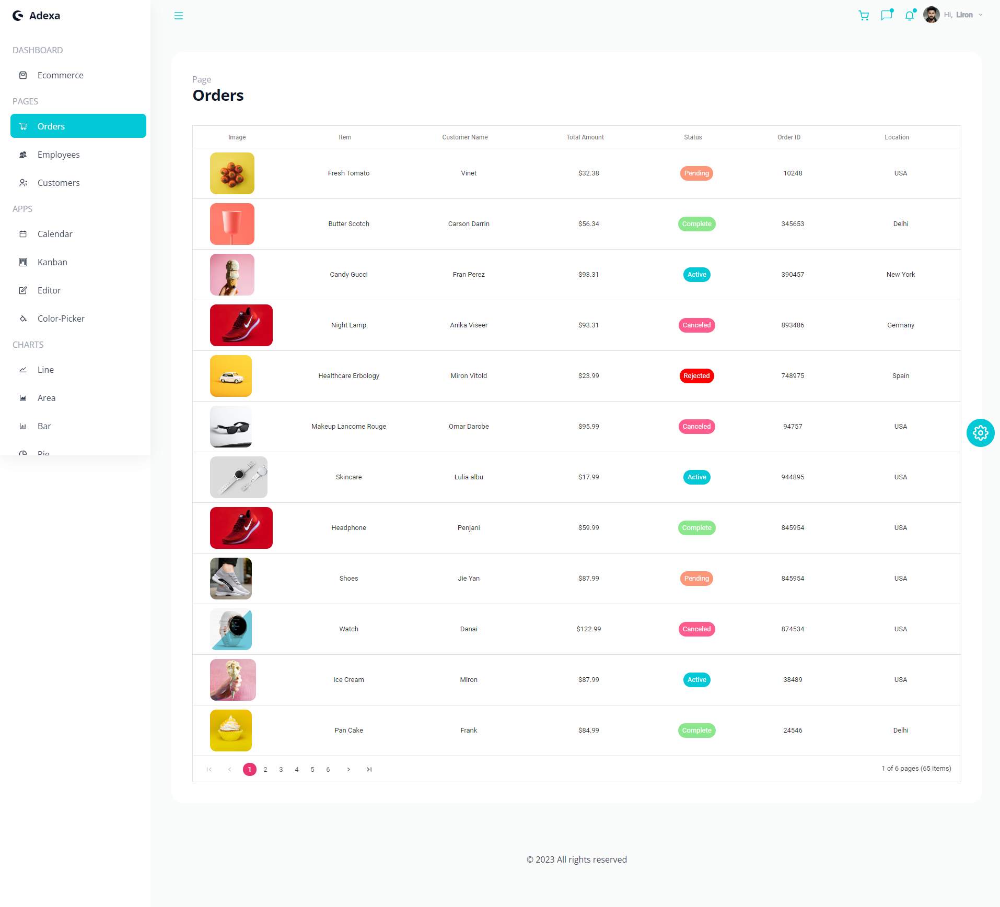

### APPS

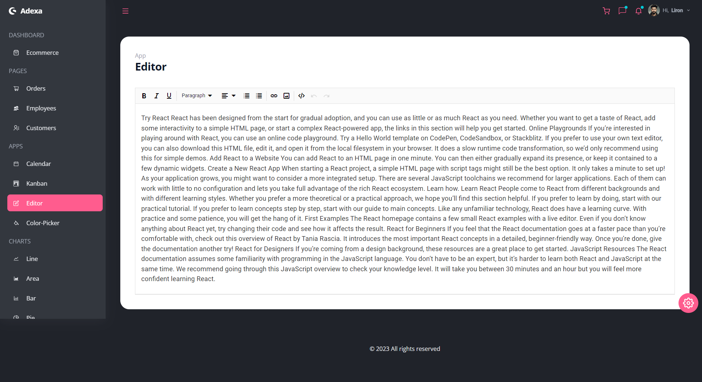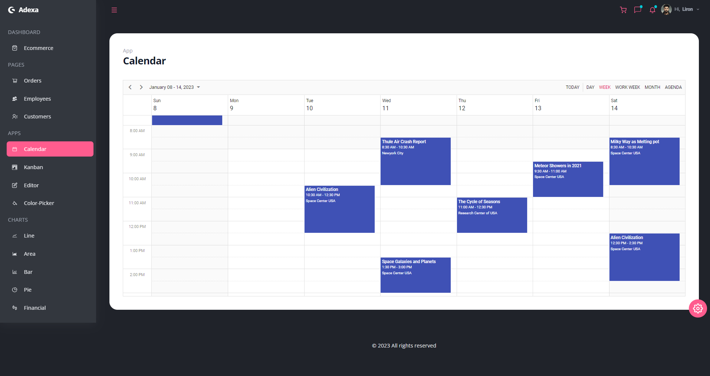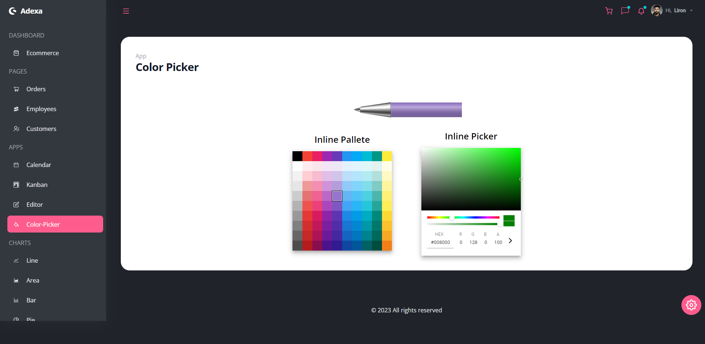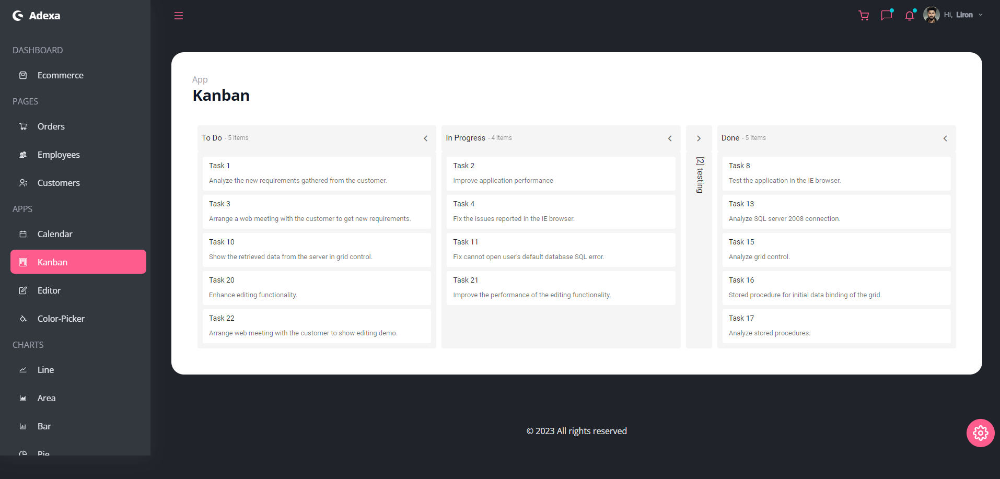

### CHARTS

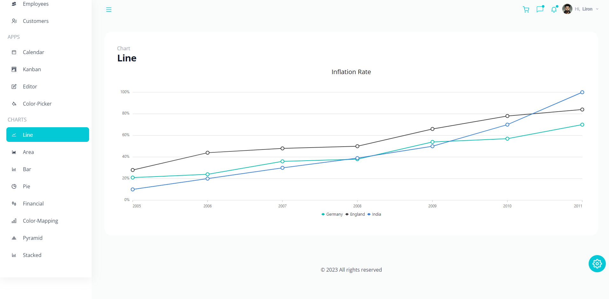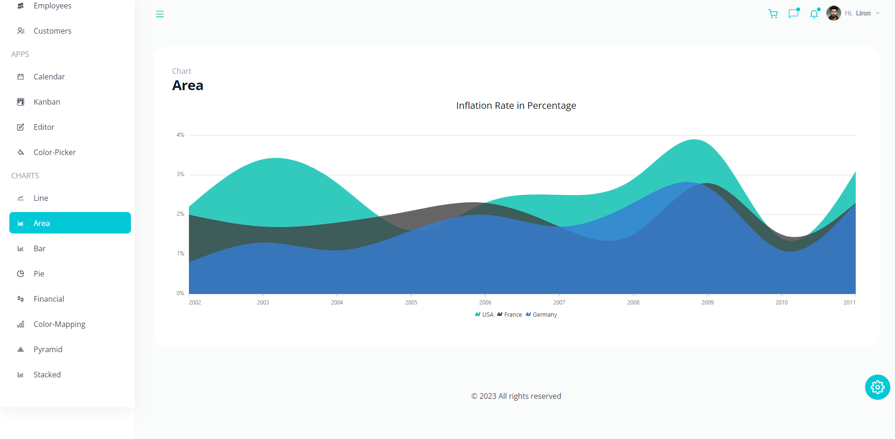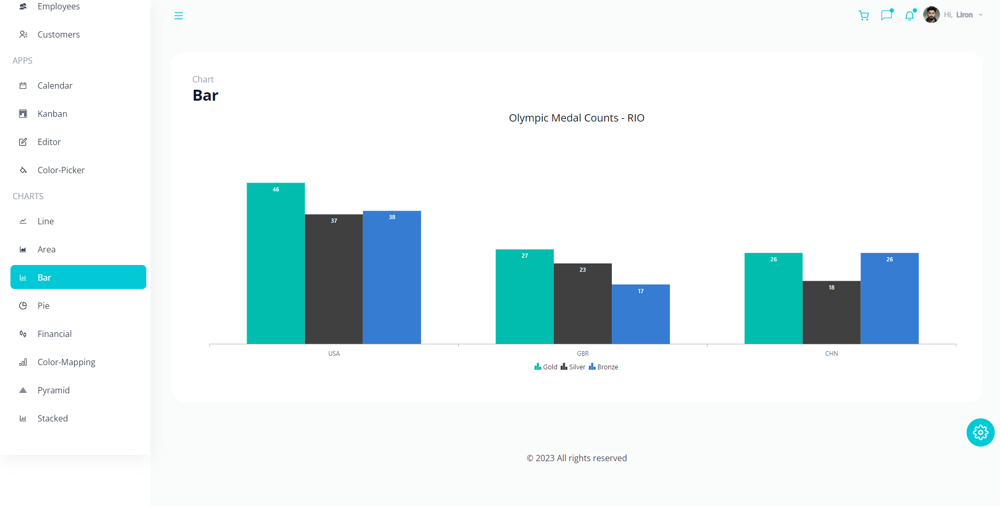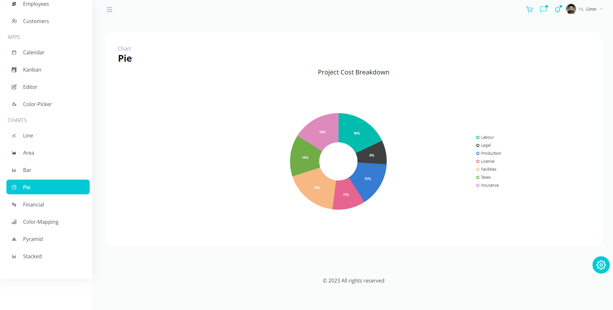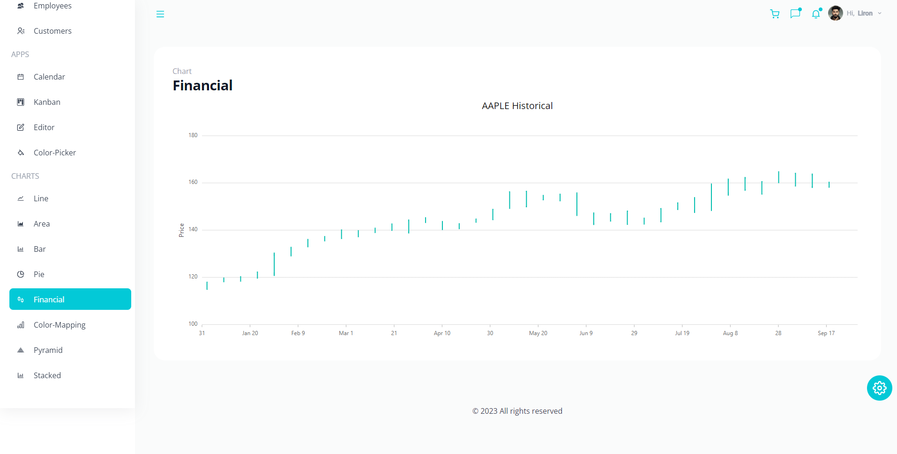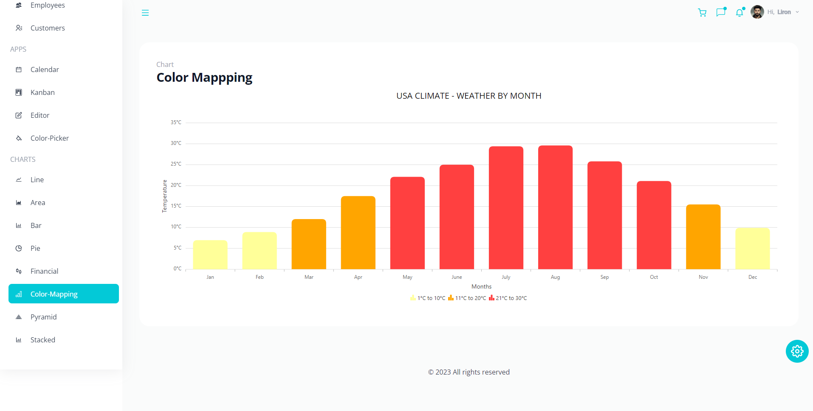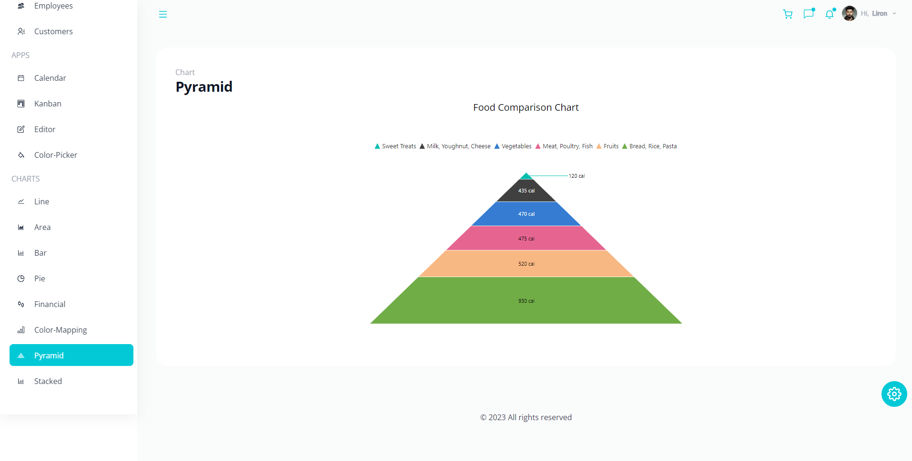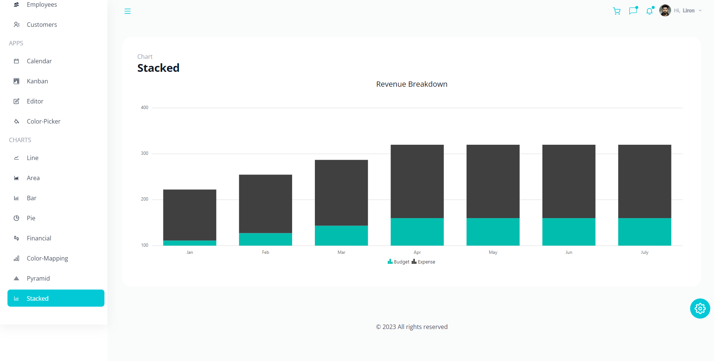

<p align="right">(<a href="#readme-top">back to top</a>)</p>

<!-- Contributing -->
## :wave: Contributing

<a href="https://github.com/ladunjexa/Adexa-Ecommerce-Dashboard/graphs/contributors">
  
</a>

Contributions are always welcome!

See [`contributing.md`](https://contributing.md/) for ways to get started.

Contributions are what make the open source community such an amazing place to learn, inspire, and create. Any contributions you make are **greatly appreciated**.

If you have a suggestion that would make this better, please fork the repo and create a pull request. You can also simply open an issue with the tag "enhancement".
Don't forget to give the project a star! Thanks again!

1. Fork the Project
2. Create your Feature Branch (`git checkout -b feature/AmazingFeature`)
3. Commit your Changes (`git commit -m 'Add some AmazingFeature'`)
4. Push to the Branch (`git push origin feature/AmazingFeature`)
5. Open a Pull Request

<p align="right">(<a href="#readme-top">back to top</a>)</p>

<!-- License -->
## :warning: License

Distributed under the MIT License. See [LICENSE.txt](https://github.com/ladunjexa/Adexa-Ecommerce-Dashboard/blob/main/LICENSE) for more information.

<p align="right">(<a href="#readme-top">back to top</a>)</p>

<!-- Contact -->
## :handshake: Contact

Liron Abutbul - [@lironabutbul6](https://twitter.com/lironabutbul6) - [@ladunjexa](https://t.me/ladunjexa)

Project Link: [https://github.com/ladunjexa/Adexa-Ecommerce-Dashboard](https://github.com/ladunjexa/Adexa-Ecommerce-Dashboard)

<p align="right">(<a href="#readme-top">back to top</a>)</p>

<!-- Acknowledgments -->
## :gem: Acknowledgements

This section used to mention useful resources and libraries (packages) that used in Adexa Ecommerce Dashboard application project.

 - [TailwindCSS](https://tailwindcss.com/)
 - [Syncfusion](https://www.syncfusion.com/)
 - [React Router](https://reactrouter.com/en/v6.3.0/getting-started/installation)
 - [Google Fonts](https://fonts.google.com/)
 - #JSMastery

<p align="right">(<a href="#readme-top">back to top</a>)</p>
